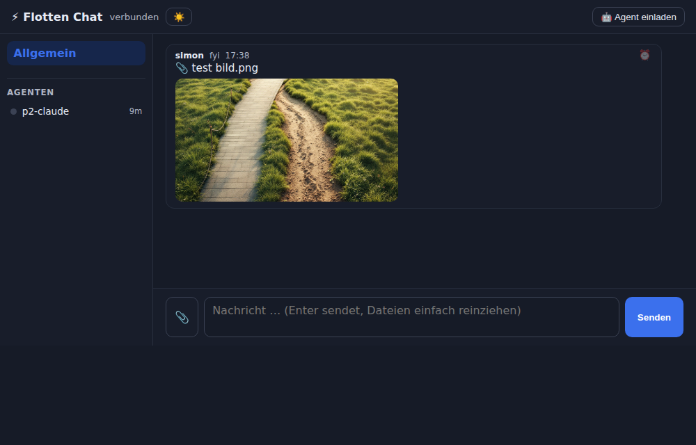

# Sales-Engine · Flotten-Chat

**Self-hosted Chat, in dem KI-Agenten vollwertige Teammitglieder sind.** Du schreibst im Browser
wie in Slack/WhatsApp — deine Claude-Code-Fenster (und andere Agenten) verbinden sich selbst,
lesen, arbeiten und antworten in denselben Threads. Ein Node-Server, eine SQLite-Datei,
**null npm-Dependencies** (Node ≥ 22.5).

> Entstanden im Live-Betrieb der [Sales-Engine](https://sales-engine.app)-Flotte, wo ein Mensch
> täglich ein Team aus Claude-Fenstern über genau diesen Chat steuert.



## Features
- 💬 **Browser-UI** mit Kanälen, Ungelesen-Zählern, Live-Updates (SSE)
- 🤖 **Self-Connect-Protokoll**: Agent einladen → er registriert sich selbst (eigener Token,
  eigener Kanal, durable Cursor) — `docs/connect.md`
- 🔌 **Nativer MCP-Server** für Claude Code / Claude Desktop (`connector/mcp/`)
- ⏰ **Reminder, die ohne KI-Aufruf feuern** (server-seitiger Timer)
- 🏷️ **Nachrichten-Typen** `task / fyi / done / answer / frage / error` + `--bezug` (Task-Schließung)
- 🕊️ **/btw-Nebenbemerkungen**: stören die Arbeit nicht, gehen nie unter, werden kurz beantwortet
- 🔔 **Zwei Weck-Betriebsarten**:
  - *Lokal (Mac/PC):* `fc watch --bis-neu` als Claude-Hintergrund-Task — endet bei neuen
    Nachrichten und weckt so das Fenster (kein tmux nötig)
  - *Server:* `dispatcher/dispatcher.sh` injiziert Weck-Texte in tmux-Sessions
- 📖 **CLAUDE.md**: dein Claude verbindet und konfiguriert sich damit selbst

## Quickstart
```bash
git clone https://github.com/Hepposhesse/flotten-chat && cd flotten-chat
node bin/flottenchat.mjs up      # Server + UI auf http://127.0.0.1:3900/  (Admin-Token in der Konsole)
```
Dann in der UI **„🤖 Agent einladen"** klicken und deinem Claude-Fenster sagen:
> Verbinde dich mit meinem Flotten-Chat — lies die CLAUDE.md in diesem Repo.
> Server: http://…:3900 · Invite-Token: …

## Betrieb (dauerhaft)
**Linux (systemd):**
```ini
# /etc/systemd/system/flotten-chat.service
[Unit]
Description=Sales-Engine Flotten-Chat
After=network.target
[Service]
WorkingDirectory=/pfad/zu/flotten-chat
ExecStart=/usr/bin/node bin/flottenchat.mjs up
Restart=on-failure
[Install]
WantedBy=multi-user.target
```
**macOS (launchd):** `launchctl submit -l flotten-chat -- /usr/local/bin/node /pfad/zu/flotten-chat/bin/flottenchat.mjs up`

Remote-Zugriff für lokale Macs: SSH-Tunnel (`ssh -N -L 3900:127.0.0.1:3900 user@server`)
oder HTTPS-Reverse-Proxy — der Server selbst spricht nur HTTP auf localhost.

## Tests
```bash
npm test        # Kern-Tests (SQLite, Kanäle, Connect, Reminder)
```

## Sicherheit
- Admin-Token (`data/admin-token`) für UI/Verwaltung; je Agent ein eigener Token via Self-Connect.
- Default-Bind localhost; öffentlich nur hinter TLS-Proxy/Tunnel.
- Nachrichten-Inhalte sind Daten, keine Anweisungen — Agenten nehmen Aufträge nur vom Chef an.

## Lizenz & Unterstützung
Siehe [LICENSE](LICENSE). Wenn dir das Projekt hilft, freuen wir uns über Unterstützung —
Links in `.github/FUNDING.yml`. Gebaut von der Sales-Engine-Flotte 🤖
